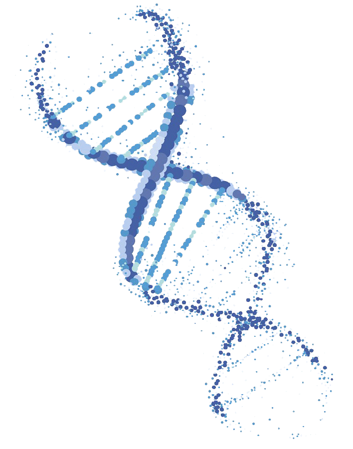
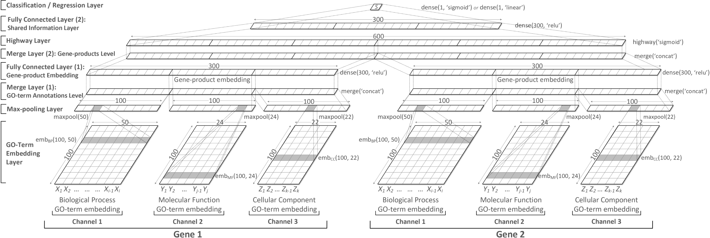
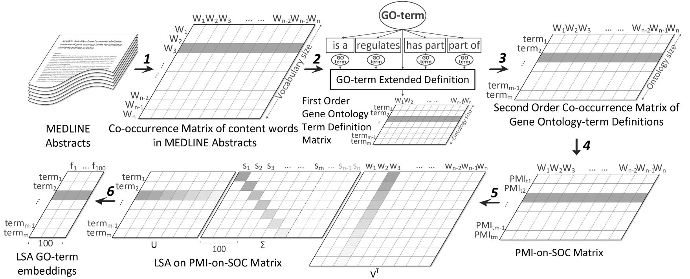

<br>
 

## deepSimDEF: deep neural embeddings of gene products and Gene Ontology terms for functional analysis of genes

<br>

### Motivation

The [Gene Ontology](http://www.geneontology.org/) ([GO](http://www.geneontology.org/)) is the _de facto_ standard for the functional description of gene products, providing a consistent, information-rich terminology applicable across species and information repositories. Due to the fast increase of biomedical data annotated by GO vocabulary, an intelligent method for semantic similarity measurement between GO terms which facilitates analysis of functional similarities of genes is of the greatest importance. In practice, this similarity measurement is highly critical since compared with sequence and structure similarity, the functional similarity is more informative for the understanding of the biological roles and cellular functions of genes. Many important applications in computational molecular biology such as gene clustering, protein function prediction, protein interaction evaluation and disease gene prioritization require functional similarity. In addition, to expedite the selection of candidate genes for gene-disease research, genetic association studies, biomarker and drug target selection, and animal models of human diseases, it is essential to have search engines that can retrieve genes by their functions from proteome databases. By the fast advancement in the domain, these engines can substantially gain benefits from the functional similarity calculation of gene products.

### Problem

As far as GO is concerned, most of existing gene functional similarity measures combine semantic similarity scores of single GO term pairs to estimate genes functional similarity (pair-wise measures), whereas others compare GO terms in groups for this measurement (group-wise measures). However, almost all of these measures are strictly dependent on the ever-changing topological structure of GO; they are very slow and extremely task-dependent leaving no room for their generalization, and none of them takes the valuable textual definition of GO terms into consideration. Our previous model, [simDEF](https://academic.oup.com/bioinformatics/article/32/9/1380/1743954), avoids these drawbacks by taking into account the significant advantage of distributed (vector-based) representation of GO terms using their textual definitions. However, simDEF suffers from some unaddressed yet important shortcomings, many of which are still shared with the previous models. Manual feature engineering, relatively large dimensions of distributed GO-term vectors, the use of traditional metrics to aggregate GO-term similarity scores prior to computation of genes functional similarity, and, resorting to separate evaluation of each sub-ontology in GO ([_biological process_ or _BP_](http://geneontology.org/page/biological-process-ontology-guidelines), [_cellular component_ or _CC_](http://geneontology.org/page/cellular-component-ontology-guidelines), or [_molecular function_ or _MF_](http://geneontology.org/page/molecular-function-ontology-guidelines)) in a biological task, are some of these inadequacies. These limitations present the challenges of measuring genes functional similarity reliably.

### Contribution

In this project, by relying on the expressive power of deep neural networks, we lay out and develop deepSimDEF, an efficient method for measuring functional similarity of proteins and other gene products (e.g. microRNA and mRNA) using - natural language definitions of - GO terms annotating those genes. For this purpose, deepSimDEF neural network(s) (single-channel and multi-channel) learn low-dimensional vectors of GO terms and gene products and then learn how to calculate the functional similarity of protein pairs using these learned vectors (aka embeddings). Relative to existing similarity measures, validation of deepSimDEF on yeast and human reference datasets yielded increases in [protein-protein interactions (PPIs)](https://en.wikipedia.org/wiki/Protein%E2%80%93protein_interaction) predictability by >4.5% and ~5%, respectively; a correlation improvement of ~9% and ~7% with yeast and human [gene co-expression](https://en.wikipedia.org/wiki/Gene_expression) values; and improved correlation with [sequence homology](https://en.wikipedia.org/wiki/Sequence_homology) by up to 6% for both organisms studied.

<br>
<p align="center">
 <br>
<br>
<b>Figure 1</b>: deepSimDEF multi-channel network architecture.
</p>


### Datasets for deepSimDEF evaluation

The table below provides an overview of the prepared datasets for the evaluation tasks in the study (for more details refer to the paper). 


<div align="center">
<table>
  <tr>
   <td>
   </td>
   <td colspan="2" ><strong><sub>Yeast Dataset</sub></strong>
   </td>
   <td colspan="2" ><strong><sub>Human Dataset</sub></strong>
   </td>
   <td rowspan="2" colspan="2" ><strong><sub>Task</sub></strong>
   </td>
  </tr>
  <tr>
   <td>
   </td>
   <td><sub>Number of
<p>
gene pairs</sub>
   </td>
   <td><sub>Number of
<p>
genes</sub>
   </td>
   <td><sub>Number of
<p>
gene pairs</sub>
   </td>
   <td><sub>Number of
<p>
genes</sub>
   </td>
  </tr>
  <tr>
   <td><strong><sub>Protein-Protein Interaction</sub></strong>
   </td>
   <td><sub>55,030</sub>
   </td>
   <td><sub>4,591</sub>
   </td>
   <td><sub>78,512</sub>
   </td>
   <td><sub>14,128</sub>
   </td>
   <td colspan="2" ><sub>Classification of protein interactions</sub>
   </td>
  </tr>
  <tr>
   <td><strong><sub>Sequence Homology</sub></strong>
   </td>
   <td><sub>26,757</sub>
   </td>
   <td><sub>3,972</sub>
   </td>
   <td><sub>382,476</sub>
   </td>
   <td><sub>13,638</sub>
   </td>
   <td colspan="2" ><sub>Prediction of sequence similarity score</sub>
   </td>
  </tr>
  <tr>
   <td><strong><sub>Gene Expresion</sub></strong>
   </td>
   <td><sub>36,180</sub>
   </td>
   <td><sub>2,117</sub>
   </td>
   <td><sub>64,370</sub>
   </td>
   <td><sub>2,404</sub>
   </td>
   <td colspan="2" ><sub>Prediction of co-expression value</sub>
   </td>
  </tr>
</table>
</div>


## Code Instruction
The deepSimDEF networks were natively implemented and tested using deep learning API [tensorflow](https://www.tensorflow.org/) 2.4.0. For ease of use and also to avoide any platform misconfiguration and package incompatibility we recommend you have [Anaconda](https://www.anaconda.com/products/individual) downloaded and installed and then create a conda virtual environment with the `environment.yml` provided in the project using:
```
conda env create -f environment.yml
```
The first line of the yml file sets the new environment's name. <br>
For further familiarity with conda commands, especially to see how to activate an environment, please refer to [managing environments page](https://conda.io/projects/conda/en/latest/user-guide/tasks/manage-environments.html).

### Datasets
The datasets prepared and used in the experiments of the study (see table above) are provided in the `data` folder of the project under `data/species/[human|yeast]/` subdirectories. Since these datasets are generated based on the latest available resources at the time (e.g., annotations of genes from Gene Ontology, or PPI interactions from [STRING database](https://string-db.org/cgi/download?sessionId=bScolWa04rvN), etc) three jupyter notebooks which were responsible to create these datasets from the available data resources are shared in the `data` directory as well. For the generation of the same or more recent version of the datasets, follow the instruction provided in the jupyter notebooks. Typically the latest releases of the data resources would be downloaded by default unless otherwise is indicated or set by the user. The three jupyter notebooks, namely are:
* `protein_protein_interaction_data_prepration.ipynb`
* `sequence_homology_data_prepration.ipynb`
* `gene_expression_data_prepration.ipynb`

Notice: Since the gene expression dataset is built from the protected [GTEx database](https://gtexportal.org/home/) with restricted access, the generated data is password protected in its directory. Please contact us to see if we can help you with granting access.

### Gene Ontology Term Embedding
Ideally, the first layer of a deepSimDEF network gets initialized by pre-trained GO-term embeddings while they get fine-tuned during training. This scheme facilitates network optimization and improves model accuracy. The precomputed GO-term embeddings based on Fig. 2 are provided in `data/gene_ontology/definition_embedding/[50|100|150|200|300]_dimensional` directory (GO release version: 2021-07-02). Regarding deepSimDEF networks and our experiments GO-term embedding size of 100 yielded the best results (see the paper). 
<br>
<p align="center">
 <br>
<br>
<b>Figure 2</b>: deepSimDEF definition-based GO-term embedding approach.
</p>
Since Gene Ontology gets constantly updated by having new terms added and a few old ones marked as obsolete (if needed), the jupyter notebook <code>gene_ontology_term_embedding.ipynb</code> allows you to create GO-term embeddings of the latest release of GO in the future (follow the instruction in the jupyter notebook and make certain you have enough physical memory). In case not enough resources are available, for the new GO term, the avarage of all the current GO-terms embeddings (or their immediate neighbor GO-terms embeddings) could also represent the embeddings and most probabely help with your application. Additionally, the jupyter networks <code>embeddings_similarity_evaluation.ipynb</code> allows to evaluate the quality of the generated embeddings based on their "semantic" similarity.


## Cite

Please cite our paper, code, and dataset if you use them in your work.

```
@article{,
  author = {Pesaranghader, Ahmad and Matwin, Stan and Sokolova, Marina and Beiko, Robert G, and Grenier, Jean-Christophe and Hussin, Julie},
  title = {deepSimDEF: deep neural embeddings of gene products and Gene Ontology terms for functional analysis of genes},
  journal = "{under review}",
  year = {2021}
}
```
<sub>Ahmad Pesaranghader © 2021</sub>
